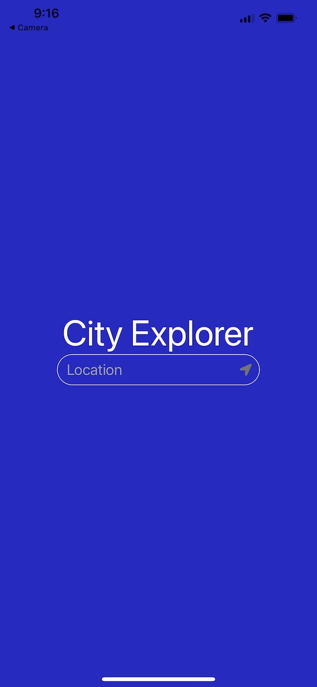
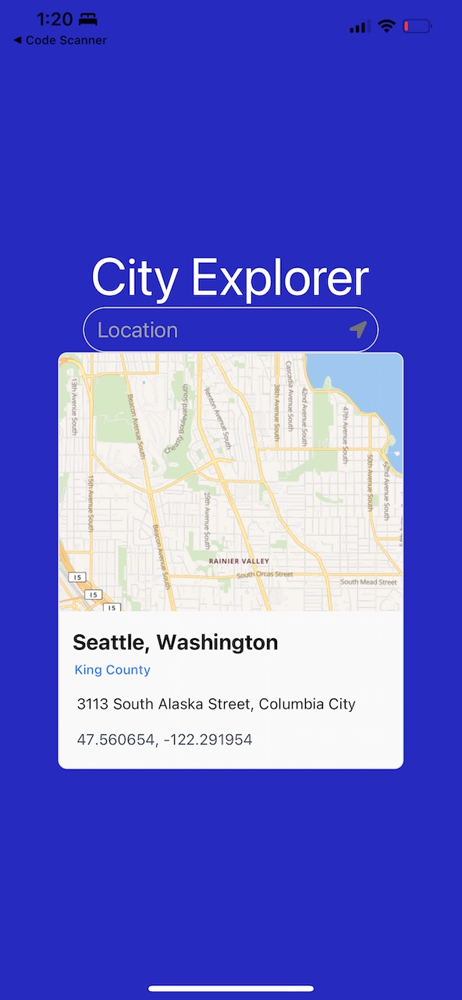
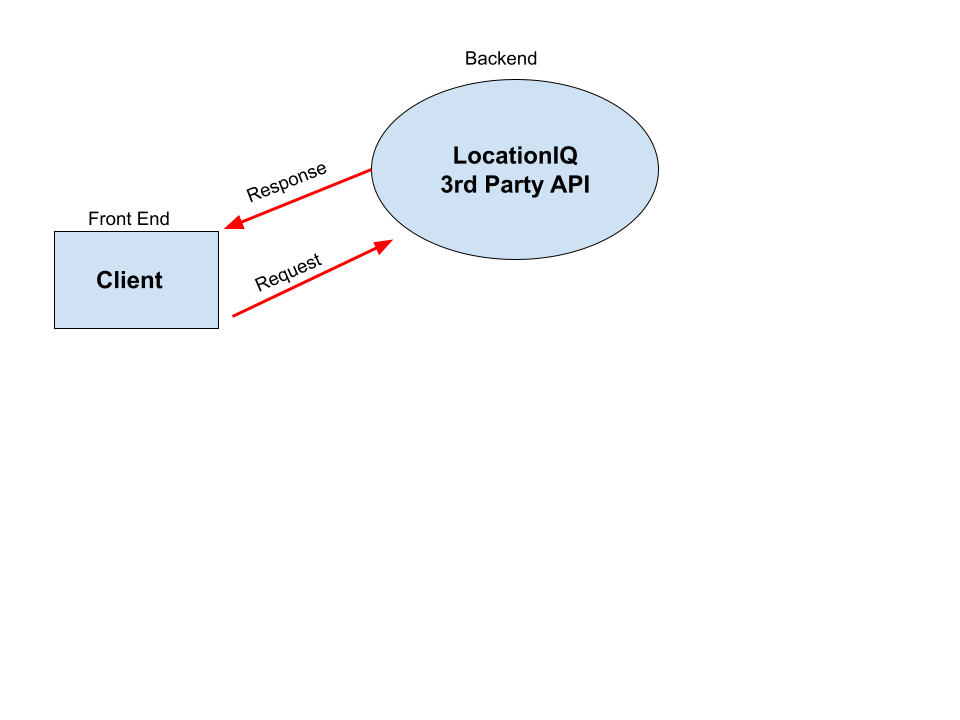

# LAB - CLASS 40 

## Project: City Explorer: Revisited with React Native

## Author: Kenny W. Lino

## Problem Domain

In this lab, we begin working with React Native to get an idea of how to create a mobile app. We are tasked with using Expo and React Native and interfacing with at least 1 native device feature, such as the Contacts, Camera or GPS. 

For my lab, I've chosen to revisit a previous project, [City Explorer](https://github.com/kennywlino/city-explorer).

To recap, City Explorer takes a location from the user to display map data, weather data and movie data. In this iteration, I've taken advantage of React Native's ability to request location data from the user to query instead of the text search.

In order to build upon the features and the UI, we also use the Native Base component library. In this project, I use their Input component to allow a user to type in their desired location or search via their current location.

## Links and Resources

- [Expo Snack Link](https://snack.expo.dev/@kennywlino/github.com-kennywlino-city-explorer-react-native)

## Example Screenshots

## UML

